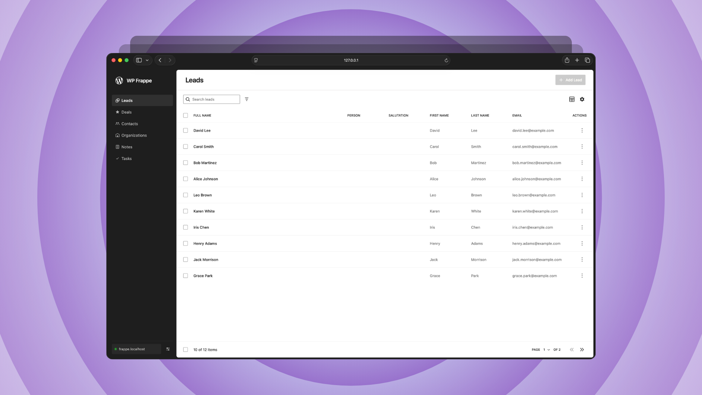

# WP Frappe Data Store

A reusable [`@wordpress/data`](https://developer.wordpress.org/block-editor/reference-guides/packages/packages-data/) store for reading and mutating Frappe DocType resources from WordPress components.

## Standalone DataViews demo

This repository includes a standalone WordPress DataViews app connected to Frappe CRM. Its WordPress-style app shell browses and manages Leads, Deals, Contacts, Organizations, Notes, and Tasks using the app's native DocTypes. The demo also loads DocType metadata dynamically from Frappe, so record forms can surface field descriptions and placeholders when available.

```sh
npm install
npm run build
cd demo
npm install
npm run dev
```

Open `http://127.0.0.1:5180`, enter the Frappe site URL, then sign in with a password session or API key and secret. The resource desk appears only after the connection is validated.

See the [complete demo setup and credentials guide](./demo/README.md) for proxy configuration, permissions, security notes, and troubleshooting.

## Install

```sh
npm install @lubusin/wp-frappe-data-store @wordpress/data
```

## Register a store

Register it once in your application entry point. The simplest setup connects directly to Frappe's REST API:

```js
import { registerFrappeDataStore } from '@lubusin/wp-frappe-data-store';

const apiKey = 'YOUR_API_KEY';
const apiSecret = 'YOUR_API_SECRET';

export const frappeStore = registerFrappeDataStore({
	storeName: 'my-plugin/frappe',
	baseUrl: 'https://crm.example.com',
	apiPath: '/api/resource',
	headers: {
		Authorization: `token ${apiKey}:${apiSecret}`,
	},
});
```

Frappe must allow requests from the application's origin. Direct access is useful for local development and trusted internal apps, but a browser bundle cannot keep an API secret: anyone who can load the app can inspect its JavaScript and network requests. Use a restricted Frappe user and token, and do not ship privileged credentials this way.

For session-cookie authentication, omit the `Authorization` header and set `credentials: 'include'`. Frappe must then allow the exact frontend origin and credentialed cross-origin requests. The user must already have a valid Frappe session.

## WordPress REST proxy pattern

For a production WordPress plugin, proxy requests through WordPress. The browser authenticates to WordPress, while the Frappe URL and API token remain server-side:

```text
WordPress UI → /wp-json/my-plugin/v1/frappe/* → Frappe /api/resource/*
```

Define the Frappe connection in `wp-config.php` or provide the values through another server-side secrets mechanism. Do not store the token in JavaScript or commit it to the plugin:

```php
define( 'MY_PLUGIN_FRAPPE_URL', 'https://crm.example.com' );
define( 'MY_PLUGIN_FRAPPE_TOKEN', 'token API_KEY:API_SECRET' );
```

Register an authenticated proxy route in the plugin. This compact example supports the resource operations used by the datastore:

```php
add_action(
	'rest_api_init',
	function () {
		register_rest_route(
			'my-plugin/v1',
			'/frappe/(?P<path>api/resource(?:/.*)?)',
			array(
				'methods'             => array( 'GET', 'POST', 'PUT', 'DELETE' ),
				'permission_callback' => function () {
					return current_user_can( 'edit_posts' );
				},
				'callback'            => function ( WP_REST_Request $request ) {
					$path = ltrim( $request['path'], '/' );
					$url  = trailingslashit( MY_PLUGIN_FRAPPE_URL ) . $path;
					$url  = add_query_arg( $request->get_query_params(), $url );

					$response = wp_remote_request(
						$url,
						array(
							'method'  => $request->get_method(),
							'headers' => array(
								'Accept'        => 'application/json',
								'Authorization' => MY_PLUGIN_FRAPPE_TOKEN,
								'Content-Type'  => 'application/json',
							),
							'body'    => $request->get_body(),
							'timeout' => 20,
						)
					);

					if ( is_wp_error( $response ) ) {
						return new WP_Error(
							'frappe_unavailable',
							$response->get_error_message(),
							array( 'status' => 502 )
						);
					}

					$status = wp_remote_retrieve_response_code( $response );
					$body   = json_decode( wp_remote_retrieve_body( $response ), true );

					return new WP_REST_Response( is_array( $body ) ? $body : array(), $status );
				},
			)
		);
	}
);
```

Choose a capability appropriate to the records exposed by your plugin; `edit_posts` is only an example. Keeping the upstream host in server configuration—and accepting only the fixed `api/resource` path—also prevents clients from turning the endpoint into an open proxy.

Expose a WordPress REST nonce to the plugin script when it is enqueued:

```php
wp_localize_script(
	'my-plugin-app',
	'myPluginSettings',
	array(
		'restNonce' => wp_create_nonce( 'wp_rest' ),
	)
);
```

Then configure the datastore exactly as in the direct connection example, changing `baseUrl` to the WordPress proxy and replacing the Frappe token with the WordPress REST nonce:

```js
export const frappeStore = registerFrappeDataStore({
	storeName: 'my-plugin/frappe',
	baseUrl: '/wp-json/my-plugin/v1/frappe',
	apiPath: '/api/resource',
	headers: {
		'X-WP-Nonce': window.myPluginSettings.restNonce,
	},
	credentials: 'same-origin',
});
```

The datastore still generates the normal `/api/resource/{doctype}/{name}` paths. The only difference is that they are sent to `/wp-json/my-plugin/v1/frappe` first, where WordPress authenticates the user and forwards them to Frappe. The proxy deliberately preserves Frappe's response body and HTTP status, including the standard `{ data: ... }` payload expected by the datastore.

For a larger integration, move the route into a `WP_REST_Controller`, add explicit argument schemas, map capabilities per DocType or operation, rate-limit expensive requests, and avoid returning sensitive upstream error details to unauthorized users.

## Use from a component

```jsx
import {
	useFrappeResourceActions,
	useFrappeResourceList,
} from '@lubusin/wp-frappe-data-store';
import { frappeStore } from './store';

export function OpenTasks() {
	const { resources, isResolving, error } = useFrappeResourceList(
		frappeStore,
		'Task',
		{
			fields: ['subject', 'status'],
			filters: [['status', '=', 'Open']],
			orderBy: 'modified desc',
			limit: 20,
		}
	);
	const { saveResource, deleteResource } = useFrappeResourceActions(frappeStore);

	if (isResolving && !resources) return <p>Loading…</p>;
	if (error) return <p>{error.message}</p>;

	return (
		<ul>
			{resources?.map((task) => (
				<li key={task.name}>
					{task.subject}
					<button onClick={() => deleteResource('Task', task.name)}>
						Delete
					</button>
				</li>
			))}
			<button onClick={() => saveResource('Task', { subject: 'New task' })}>
				Add task
			</button>
		</ul>
	);
}
```

Calling `getResource` or `getResourceList` through `useSelect` triggers their resolvers automatically. The package exports `createFrappeDataStore` for custom registries, `createFrappeRequest` for standalone transport setup, and `loadDocTypeDefinition` for retrieving normalized Frappe DocType metadata.

## DocType metadata

Frappe stores field definitions in the `DocType` DocType. The package can fetch that definition and normalize it into a smaller, UI-oriented shape suitable for generating forms, table columns, filters, and labels.

### Use metadata in a component

Pass the registered store and DocType name to `useDocTypeDefinition`. The hook loads the definition when needed, caches it, and updates the component as the request progresses:

```tsx
import { useDocTypeDefinition } from '@lubusin/wp-frappe-data-store';
import { frappeStore } from './store';

function LeadForm() {
	const { docTypeDefinition, isResolving, error } =
		useDocTypeDefinition(frappeStore, 'CRM Lead');

	if (isResolving && !docTypeDefinition) {
		return <p>Loading fields…</p>;
	}

	if (error) {
		return <p>Could not load fields.</p>;
	}

	if (!docTypeDefinition) {
		return null;
	}

	return (
		<form>
			{docTypeDefinition.fields.map((field) => (
				<label key={field.id}>
					{field.label}
					<input
						name={field.id}
						required={field.required}
						readOnly={field.readOnly}
						placeholder={field.placeholder}
					/>
				</label>
			))}
		</form>
	);
}
```

The hook uses the connection already configured on `frappeStore`; no second transport setup is needed. Behind the scenes it requests `/api/resource/DocType/{doctype}`. The authenticated Frappe user must have permission to read that DocType definition.

### Normalized result

When loading succeeds, `useDocTypeDefinition` exposes the normalized definition as `docTypeDefinition`:

```tsx
const { docTypeDefinition, isResolving, error } =
	useDocTypeDefinition(frappeStore, 'CRM Lead');
```

Its shape is:

```ts
type DocTypeDefinition = {
	name: string;
	titleField: string;
	fields: ResourceFieldDefinition[];
};

type ResourceFieldDefinition = {
	id: string;
	label: string;
	description?: string;
	placeholder?: string;
	type?: 'text' | 'textarea' | 'select' | 'checkbox' | 'date' | 'datetime' | 'number';
	options?: string[];
	required?: boolean;
	readOnly?: boolean;
};
```

The hook loads this metadata through the configured store and caches it by DocType. During normalization, the package:

- Uses Frappe's `title_field`, falling back to the first visible field and then `name`.
- Converts Frappe field types into a smaller set of UI-friendly types.
- Splits newline-delimited `Select` options into an array.
- Preserves labels, descriptions, placeholders, required state, and read-only state.
- Excludes hidden fields and layout-only controls such as section breaks, column breaks, buttons, HTML, and child tables.
- Generates a human-readable label from the field name when Frappe does not provide one.

For example, when the hook receives a Frappe field such as:

```json
{
	"fieldname": "lead_name",
	"label": "Lead name",
	"fieldtype": "Data",
	"reqd": 1,
	"description": "The person or organization entering the pipeline"
}
```

it exposes that field in `docTypeDefinition.fields` as:

```json
{
	"id": "lead_name",
	"label": "Lead name",
	"type": "text",
	"required": true,
	"readOnly": false,
	"description": "The person or organization entering the pipeline"
}
```

### Use metadata outside React

The hook is the recommended API for components. If metadata is needed outside React, use the equivalent resolver-backed selector:

```js
import { resolveSelect } from '@wordpress/data';

const definition = await resolveSelect(frappeStore).getDocTypeDefinition(
	'CRM Lead'
);
```

Both the hook and selector use the registered store's connection and share its resolved definition. Repeated reads of the same DocType use the cached value rather than making another request. Definitions currently remain cached for the lifetime of the page and have no automatic expiry, so reload the page after changing fields in Frappe when live schema changes matter.

The lower-level `loadDocTypeDefinition(request, doctype)` helper is only needed when using the metadata normalizer without a registered `@wordpress/data` store.

## API

- **Store registration & creation**: `registerFrappeDataStore`, `createFrappeDataStore`
- **Hooks**: `useFrappeResource`, `useFrappeResourceList`, `useFrappeResourceActions`, `useDocTypeDefinition`
- **Selectors**: `getResource`, `getResourceList`, `getDocTypeDefinition`, `isRequestPending`, `getRequestError`
- **Actions**: `fetchDocTypeDefinition`, `fetchResource`, `fetchResourceList`, `saveResource`, `deleteResource`, `invalidateResourceLists`
- **Transport & Errors**: `createFrappeRequest`, `FrappeRequestError`
- **Utilities & Helpers**: `loadDocTypeDefinition`, `getListKey`, `getResourceKey`, `toFrappeQuery`
- **TypeScript Types**: `FrappeDataStore`, `FrappeStoreConfig`, `FrappeResource`, `FrappeResourceActions`, `FrappeListQuery`, `FrappeFilter`, `FrappeRequest`, `FrappeRequestOptions`, `FrappeBoundSelectors`, `DocTypeDefinition`, `ResourceFieldDefinition`, `RequestStatus`

List responses are normalized by Frappe's `name` field. When an explicit `fields` list is supplied, the store automatically includes `name`.

## Development

```sh
npm test
npm run typecheck
npm run build
```
